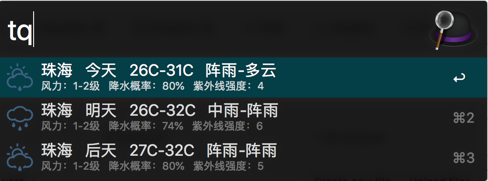
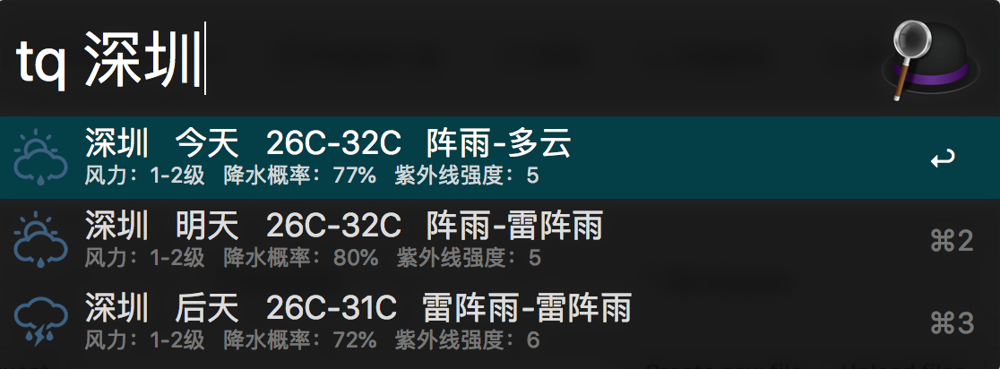
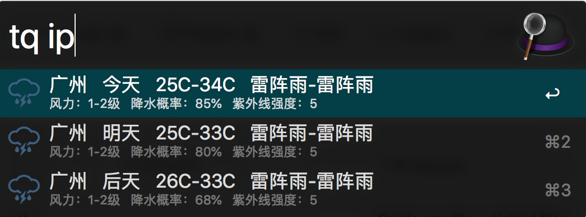

# weather-Alfred
Weather Inquiry by Alfred

If you want to use this project，your should do somethings.

First, download this porojct and open weather.alfredworkflow.

Second, sign in [和风天气](https://www.heweather.com), gain you api-key.

Third, open Alfred and find 天气, change API_KEY in weather.py.

## Demo:

>>>>>>
>>>>>>
>>>>>>
